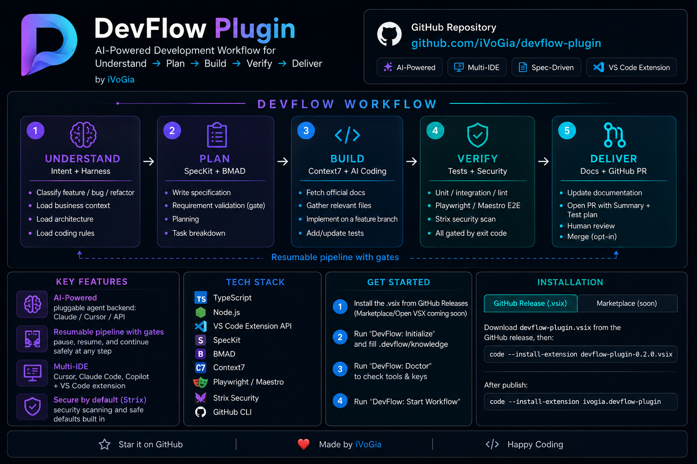

# DevFlow



**Languages:** 🇬🇧 [English](#-english) · 🇻🇳 [Tiếng Việt](#-tiếng-việt)

---

<a id="english"></a>

## 🇬🇧 English

DevFlow is a **workflow-as-plugin**: a single CLI orchestrator that runs a full
spec-driven development pipeline for any request (an idea, a bug, a feature, or a
whole new project) and exposes it as slash commands across **Cursor**,
**Claude Code**, and **GitHub Copilot**.

Type `/devflow "<request>"` in your editor; the thin command layer shells out to
the `devflow` CLI, which drives every stage and stops for human review at the PR.

### Pipeline

```
User Request
  → Intent Classification (feature | bug | refactor)
  → Repository Harness (Business / Architecture / Coding Rules)
  → Repo Discovery (auto-detect web/mobile/stack)
  → Intake / Clarify (Analyst — gate or --interactive Q&A)
  → SpecKit (specification)
  → Requirement Validation (gate)
  → BMAD (planning + task split)
  → Context7 (official docs) + Existing Code
  → Coding Agent
  → Static Validation (unit / integration / lint) (gate)
  → Playwright / Maestro (E2E) (gate)
  → Strix (security validation) (gate)
  → Documentation Agent
  → GitHub PR (Summary + Test plan)
  → Human Review → Merge (opt-in: `devflow merge`)
```

Each stage has a **preflight**, a **run**, and a **gate**. Failed gates halt the
pipeline and print a resume command. Runs persist under `.devflow/runs/<id>/`.

### Install

```bash
# Latest release (recommended)
npm install -g git+https://github.com/iVoGia/devflow-plugin.git#v0.2.2

# Or from this repo (development)
git clone https://github.com/iVoGia/devflow-plugin.git
cd devflow-plugin && npm install && npm run build && npm link

devflow --version
```

### Skills & slash commands

DevFlow ships **3 skills** (slash commands). Each skill invokes the `devflow` CLI — you do not run stages manually.

#### Quick pick — which skill?

| Skill | When to use | Example |
| --- | --- | --- |
| `/devflow-init` | **First time** adding DevFlow to a project | *(no extra text)* |
| `/devflow` | New feature, idea, refactor, greenfield project | `Add dark mode to settings` |
| `/devflow-fixbug` | **Fix a bug** on existing code | `App crashes on Save — expected home, got SIGABRT` |

**Rules of thumb:**

- No `.devflow/` yet → run `/devflow-init` first.
- Something **broken** → `/devflow-fixbug` (shorter pipeline, 5 Whys, no intent LLM).
- **New capability** or vague idea → `/devflow`.

#### Step 1 — First-time setup (once per project)

1. **Install CLI** (see [Install](#install) above).
2. **Open project** in Cursor / VS Code / terminal:

| IDE | Command |
| --- | --- |
| **Cursor** | `/devflow-init` in chat |
| **Claude Code** | `/devflow-init` |
| **GitHub Copilot** | `/devflow-init` in Chat (agent mode) |
| **Terminal** | `devflow init` |

3. **Fill the harness** — edit these three files briefly:

- `.devflow/knowledge/business.md` — product, users
- `.devflow/knowledge/architecture.md` — stack, folder layout
- `.devflow/knowledge/coding-rules.md` — lint, tests, conventions

4. **Verify environment:** `devflow doctor` — fix all FAIL items before running workflows.

#### Step 2 — Daily workflow

**`/devflow`** — features / ideas / refactors

- **Cursor:** `/devflow Add profile screen with avatar and display name`
- **Terminal:** `devflow run "Add profile screen with avatar and display name"`
- **Vague new project:** `devflow run --interactive "Build a mobile todo app"`

Full pipeline: intent → harness → discover → intake → speckit → validate → bmad → context → coding → static → e2e → strix → docs → **PR** → review → merge.

**`/devflow-fixbug`** — bugs (short pipeline + 5 Whys)

- **Cursor:** `/devflow-fixbug Login crash on Save. Steps: open app → enter password → Save. Expected: home. Actual: crash iOS 17.`
- **Terminal:** `devflow run --mode fixbug "Login crash on Save. Expected: home. Actual: SIGABRT iOS 17, Flutter 3.22."`

A good bug report includes: **symptom**, **steps to reproduce**, **expected vs actual**, **environment** (OS, version).

Fixbug pipeline: harness → discover → **rootcause (5 Whys)** → context → coding → static → e2e → strix → docs → **PR**.

Skips intent classification (saves tokens), intake, speckit, bmad — writes `docs/rootcause.md` before coding.

#### Step 3 — When the pipeline stops (gates)

DevFlow does **not** skip tests/lint. On failure, the terminal prints a resume command.

| Situation | Action |
| --- | --- |
| Stopped at **intake** | Answer questions, then `devflow run --resume latest --from intake "enriched request"` |
| Interactive intake | `devflow run --resume <id> --from intake --interactive` |
| **Test/lint fail** | Fix code → `devflow run --resume latest --from static` |
| **E2E fail** | Fix tests → `devflow run --resume latest --from e2e` |
| **PR opened** | Review on GitHub → `devflow merge --squash` after approval |

Check run status: `ls .devflow/runs/` · `cat .devflow/runs/<id>/state.json`

#### `/devflow` vs `/devflow-fixbug`

| | `/devflow` | `/devflow-fixbug` |
| --- | --- | --- |
| Intent classification | LLM: feature / bug / refactor | **Skipped** — preset bug |
| Intake / SpecKit / BMAD | Full spec + plan | **Skipped** |
| Root cause | Optional in spec | **5 Whys** → `docs/rootcause.md` |
| PR branch | `feat/` / `fix/` / `refactor/` | Always `fix/` |
| Best for | Features, ideas, refactors | Bugs on existing code |

#### Common CLI commands

```bash
devflow init                              # = /devflow-init
devflow doctor                            # check tools & API keys
devflow run "..."                         # = /devflow
devflow run --mode fixbug "..."           # = /devflow-fixbug
devflow run --interactive "..."           # intake Q&A in terminal
devflow run --dry-run "..."               # preview stages only
devflow run --resume latest               # continue after gate failure
devflow run --resume <id> --from coding   # restart from a stage
devflow merge --squash                    # merge PR after review
devflow generate                          # regenerate slash commands after CLI upgrade
```

#### After upgrading DevFlow on another machine

1. Update CLI: `npm install -g git+https://github.com/iVoGia/devflow-plugin.git#v0.2.2`
2. In each project: `devflow generate` (picks up new slash commands like `/devflow-fixbug`)
3. Your `.devflow/knowledge/*.md` and app source **do not** need to change

### VS Code / Cursor extension

Optional GUI in [`extension/`](extension/): Command Palette (**Start / Init / Doctor / Resume**), Activity Bar **Runs** tree, status bar. Bundles the CLI.

```bash
cd extension && npm install && npm run package
code --install-extension devflow-plugin-*.vsix
```

See [extension/PUBLISHING.md](extension/PUBLISHING.md) for Marketplace / Open VSX.

---

<a id="tiếng-việt"></a>

## 🇻🇳 Tiếng Việt

DevFlow là **workflow-as-plugin**: một CLI orchestrator chạy pipeline phát triển
theo spec cho mọi request (ý tưởng, bug, feature, project mới) và expose thành
slash command trên **Cursor**, **Claude Code**, và **GitHub Copilot**.

Gõ `/devflow "<request>"` trong editor; lớp command mỏng gọi CLI `devflow`, tự
chạy từng stage và dừng ở PR để bạn review.

### Pipeline

```
User Request
  → Phân loại intent (feature | bug | refactor)
  → Repository Harness (Business / Architecture / Coding Rules)
  → Repo Discovery (tự nhận web/mobile/stack)
  → Intake / Clarify (Analyst — gate hoặc --interactive Q&A)
  → SpecKit (specification)
  → Requirement Validation (gate)
  → BMAD (planning + task split)
  → Context7 (official docs) + Existing Code
  → Coding Agent
  → Static Validation (unit / integration / lint) (gate)
  → Playwright / Maestro (E2E) (gate)
  → Strix (security validation) (gate)
  → Documentation Agent
  → GitHub PR (Summary + Test plan)
  → Human Review → Merge (opt-in: `devflow merge`)
```

Mỗi stage có **preflight**, **run**, và **gate**. Gate fail → pipeline dừng, in
lệnh resume. Run lưu tại `.devflow/runs/<id>/`.

### Cài đặt

```bash
# Bản release mới nhất (khuyên dùng)
npm install -g git+https://github.com/iVoGia/devflow-plugin.git#v0.2.2

# Hoặc từ repo (development)
git clone https://github.com/iVoGia/devflow-plugin.git
cd devflow-plugin && npm install && npm run build && npm link

devflow --version
```

### Skills & slash commands — hướng dẫn dùng

DevFlow có **3 skill** (slash command). Mỗi skill gọi CLI `devflow` — bạn không cần tự chạy từng stage.

#### Tóm tắt nhanh — dùng skill nào?

| Skill | Khi nào dùng | Ví dụ request |
| --- | --- | --- |
| `/devflow-init` | **Lần đầu** gắn DevFlow vào project | *(không cần mô tả thêm)* |
| `/devflow` | Feature mới, ý tưởng, refactor, project greenfield | `Thêm dark mode vào settings` |
| `/devflow-fixbug` | **Sửa bug** trên code đã có | `App crash khi tap Save — expected home, actual SIGABRT` |

**Quy tắc chọn nhanh:**

- Project **chưa có** `.devflow/` → chạy `/devflow-init` trước.
- Có **lỗi / hành vi sai** → `/devflow-fixbug` (nhanh hơn, có 5 Whys, không tốn token phân loại intent).
- **Tính năng mới** hoặc **ý tưởng chưa rõ** → `/devflow`.

#### Bước 1 — Setup lần đầu (mỗi project một lần)

1. **Cài CLI** (xem [Cài đặt](#cài-đặt) ở trên).
2. **Mở project** trong Cursor / VS Code / terminal:

| IDE | Lệnh |
| --- | --- |
| **Cursor** | Gõ `/devflow-init` trong chat |
| **Claude Code** | Gõ `/devflow-init` |
| **GitHub Copilot** | Gõ `/devflow-init` trong Chat (agent mode) |
| **Terminal** | `devflow init` |

3. **Điền harness** — mở và viết ngắn gọn vào 3 file:

- `.devflow/knowledge/business.md` — sản phẩm là gì, user là ai
- `.devflow/knowledge/architecture.md` — stack, cấu trúc thư mục
- `.devflow/knowledge/coding-rules.md` — lint, test, quy ước code

4. **Kiểm tra môi trường:** `devflow doctor` — sửa hết mục FAIL trước khi chạy workflow.

#### Bước 2 — Chạy workflow hàng ngày

**`/devflow`** — feature / ý tưởng / refactor

- **Cursor:** `/devflow Thêm màn hình profile với avatar và tên user`
- **Terminal:** `devflow run "Thêm màn hình profile với avatar và tên user"`
- **Request mơ hồ:** `devflow run --interactive "Làm app todo mobile"`

Pipeline đầy đủ: intent → harness → discover → intake → speckit → validate → bmad → context → coding → static → e2e → strix → docs → **PR** → review → merge.

**`/devflow-fixbug`** — sửa bug (pipeline ngắn + 5 Whys)

- **Cursor:** `/devflow-fixbug Login crash khi tap Save. Steps: mở app → nhập pass → Save. Expected: home. Actual: crash iOS 17.`
- **Terminal:** `devflow run --mode fixbug "Login crash khi tap Save. Expected: home. Actual: SIGABRT iOS 17, Flutter 3.22."`

Bug report nên có: **symptom**, **steps to reproduce**, **expected vs actual**, **environment** (OS, version).

Pipeline fixbug: harness → discover → **rootcause (5 Whys)** → context → coding → static → e2e → strix → docs → **PR**.

Khác `/devflow`: **không** phân loại intent (tiết kiệm token), **không** speckit/bmad — phân tích root cause `docs/rootcause.md` trước khi code.

#### Bước 3 — Khi pipeline dừng (gate)

DevFlow **không tự bỏ qua** test/lint. Nếu dừng, terminal in lệnh resume.

| Tình huống | Làm gì |
| --- | --- |
| Dừng ở **intake** | Trả lời câu hỏi, rồi `devflow run --resume latest --from intake "request đã bổ sung đủ"` |
| Intake interactive | `devflow run --resume <id> --from intake --interactive` |
| **Test/lint fail** | Sửa code → `devflow run --resume latest --from static` |
| **E2E fail** | Sửa test → `devflow run --resume latest --from e2e` |
| **PR đã mở** | Review GitHub → `devflow merge --squash` (sau approve) |

Xem trạng thái run: `ls .devflow/runs/` · `cat .devflow/runs/<id>/state.json`

#### Bảng so sánh `/devflow` vs `/devflow-fixbug`

| | `/devflow` | `/devflow-fixbug` |
| --- | --- | --- |
| Intent classification | LLM phân loại feature / bug / refactor | **Bỏ qua** — preset bug (tiết kiệm token) |
| Intake / SpecKit / BMAD | Có — spec + plan đầy đủ | **Bỏ qua** — pipeline ngắn |
| Root cause | Tuỳ spec | **5 Whys** (なぜなぜ分析) → `docs/rootcause.md` |
| Branch PR | `feat/` / `fix/` / `refactor/` | Luôn `fix/` |
| Phù hợp | Feature, ý tưởng, refactor, project mới | Bug trên codebase đã có |

#### Lệnh terminal thường dùng

```bash
devflow init                              # = /devflow-init
devflow doctor                            # kiểm tra tool & API keys
devflow run "..."                         # = /devflow
devflow run --mode fixbug "..."           # = /devflow-fixbug
devflow run --interactive "..."           # intake hỏi trong terminal
devflow run --dry-run "..."               # xem stages sẽ chạy, không thực thi
devflow run --resume latest               # tiếp run sau gate fail
devflow run --resume <id> --from coding   # chạy lại từ stage cụ thể
devflow merge --squash                    # merge PR sau review
devflow generate                          # tạo lại slash commands sau khi update DevFlow
```

#### Sau khi update DevFlow trên máy khác

1. Update CLI: `npm install -g git+https://github.com/iVoGia/devflow-plugin.git#v0.2.2`
2. Trong từng project: `devflow generate` (có slash command mới như `/devflow-fixbug`)
3. File `.devflow/knowledge/*.md` và source app **không cần** đổi

### Extension VS Code / Cursor

GUI tùy chọn trong [`extension/`](extension/): Command Palette (**Start / Init / Doctor / Resume**), cây **Runs** trên Activity Bar, status bar. Bundle sẵn CLI.

```bash
cd extension && npm install && npm run package
code --install-extension devflow-plugin-*.vsix
```

Xem [extension/PUBLISHING.md](extension/PUBLISHING.md) cho Marketplace / Open VSX.

---

## Reference (EN)

### Architecture

- **CLI orchestrator** (`devflow`, TypeScript/Node): source of truth; shells out to real tools and gates on artifacts.
- **Agent backend** (pluggable): LLM stages via `claude -p`, `cursor-agent -p`, or OpenAI-compatible API.
- **Command generator**: `commands/*.yaml` → Cursor / Claude / Copilot / SKILL.md.

### Prerequisites

`devflow doctor` checks based on your config:

| Tool | Used by | Install |
| --- | --- | --- |
| Claude Code (`claude`) or Cursor CLI (`cursor-agent`) | agent backend | vendor docs |
| `specify` / `uvx` | SpecKit | `uv tool install specify-cli` |
| Node.js 18+ (`npx`) | BMAD, Playwright | nodejs.org |
| `strix` + Docker | Strix security | `pipx install strix-agent` |
| `gh` (authenticated) | GitHub PR | `gh auth login` |
| `maestro` + Java 17 | E2E mobile (if enabled) | get.maestro.mobile.dev |

| Variable | Purpose |
| --- | --- |
| `CONTEXT7_API_KEY` | Context7 rate limits (optional) |
| `STRIX_LLM` | LLM for Strix |
| `LLM_API_KEY` | Provider key for Strix |
| `DEVFLOW_LLM_*` | Only for `api` agent backend |

### Configuration

See `.devflow/config.yaml` (from `devflow init`):

- `agent: claude | cursor | api`
- Each stage: `enabled`, gating stages: `gate`
- `stages.static.{unit,integration,lint,format}` — empty = auto-detect from `package.json`
- `stages.e2e.engine: playwright | maestro | none`
- `stages.pr.{base,draft,autoMerge}`

### Development

```bash
npm run dev -- run --dry-run "test"
npm run typecheck && npm run build
```

```
src/
  cli.ts pipeline.ts config.ts
  agent/ stages/ workflow/ util/
commands/ generators/ templates/
```

## License

MIT
